## Resume Analysis System with ReAct Agent

### 🚀 Setup

1. Create and activate a virtual environment:
    ```bash
    pipenv shell
2. Install dependencies
    ```bash
    pip install -r req.txt
3. Set up environment variables:
Create a .env file in the root folder and add
    ```bash
    OPENAI_API_KEY=<your_openai_api_key>
    PG_DATABASE=postgres
    PG_HOST=127.0.0.1
    PG_PORT=5432
    PG_USER=postgres
    PG_PASSWORD=<your_password>
4. Make sure PostgreSQL is running and pgvector extension is enabled:
    ```bash
    CREATE EXTENSION IF NOT EXISTS vector;  
## First task
1. download csv https://www.kaggle.com/datasets/snehaanbhawal/resume-dataset
2. split into small chunks.
3. generating embedding: Convert the parsed data into numerical representations(embeddings) that can be easily processed by ml algorithms. This typically involves using techniques like word embeddings or sentence embeddings. 
4. Storing Embeddings in a Vector Database. Save the generated embeddings into a vector database. As a vector store, you can choose PostgreSQL, chromadb, faiss etc.
5. Retrieving candidate details: extract and display specific information about each candidate, such as name, profession and year of commercial experience.
6. generating experience summary: based on the parsed data and embeddings, generate a summary of each candidate strongest skills and professional highlights.

the result should be: The repository contains a straightforward web app that lists candidates. Users can click on any candidate to view detailed information and a summary of their profile

#### 1. Storing Embeddings in a Vector Database: ChromaDB
#### 2. To extract candidates from a CSV file, run the process_data.py file.
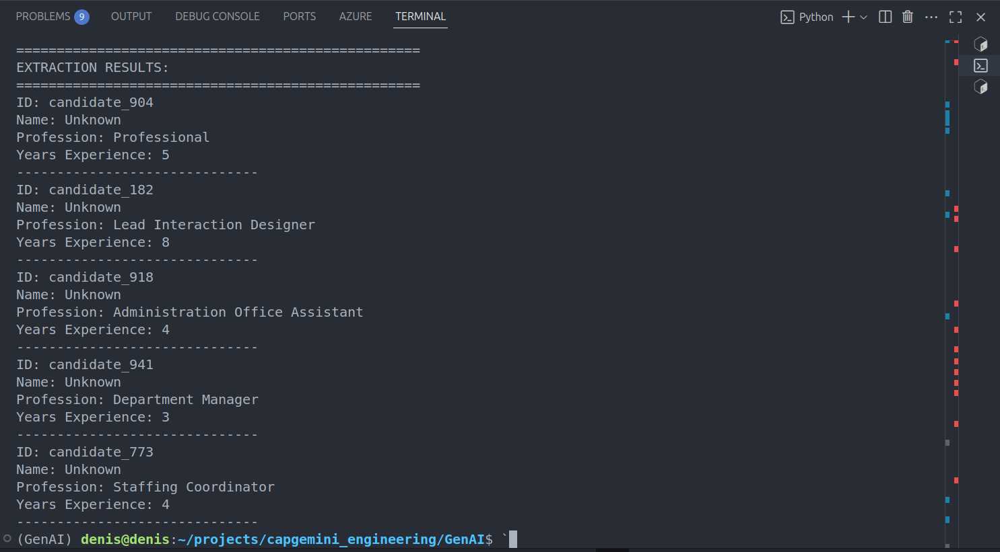
#### 3. If you want to generate summaries of selected candidates, run the generate_summaries.py file.
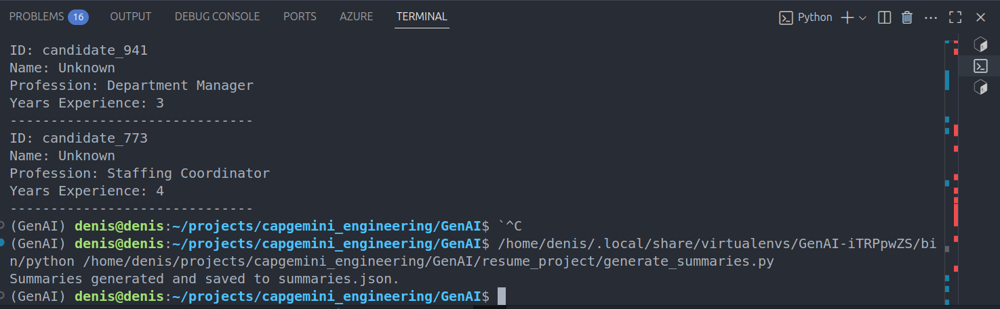
#### 4. To see that the repository contains a web application listing candidates - run:
```
streamlit run resume_project/app.py
```
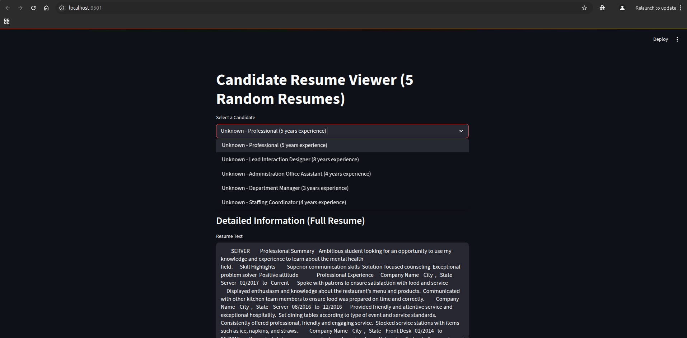
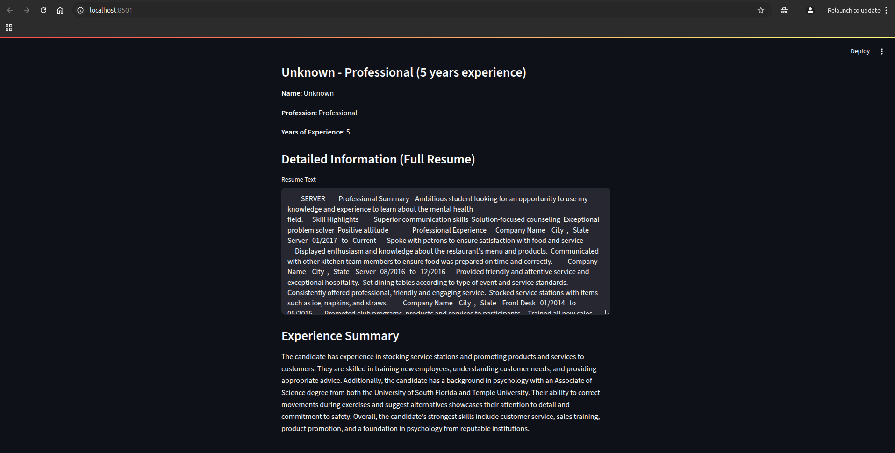

## Second task

Enhancing the Resume Analysis System with a ReAct Agent.
Extend your existing resume analysis system by integrating a ReAct(Reason acting) agent using Llamaindex.  This agent will interact with multiple tools, including a retrieval tool by pgvector, to answer user queries about candidates and engage in broader conversation. Instructions:
1. Implement the Retrieval Tool:
a. Develop a tool that connects to your vector db and retrieves relevant candidate information based on user queries
b. ensure the tool returns concise summaries or key information from the retrieved data. 
2. Develop Additional tools:
a. Create at least two more tools to enhance the agent's capabilities 
example include: 
a. general knowledge tool: allows the agent to answer general questions unrelated to the resumes, enabling broader conversations.
b. one of pre-build tools:
https://docs.llamaindex.ai/en/stable/community/integrations/
3. Integrate the ReAct agent:
a. utilize llamaindex to build an agent that processes user inputs determines which tool(s) to use and formulates appropriate responses.
b. incorporate all developed tools into the agent's toolkit, allowing it to fetch information and perform analyses as needed

#### tool that connects to your vector db and retrieves relevant candidate information based on user queries. Need to run:
```
python resume_project/store_to_pgvector.py
python resume_project/retrievaltool_pgvector.py
```
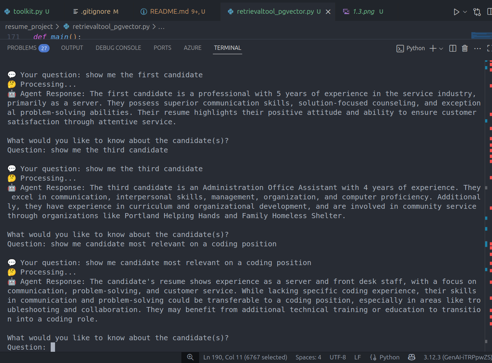
#### general knowledge tool: allows the agent to answer general questions unrelated to the resumes, enabling broader conversations. Need to run:
```
python resume_project/store_to_pgvector.py
```
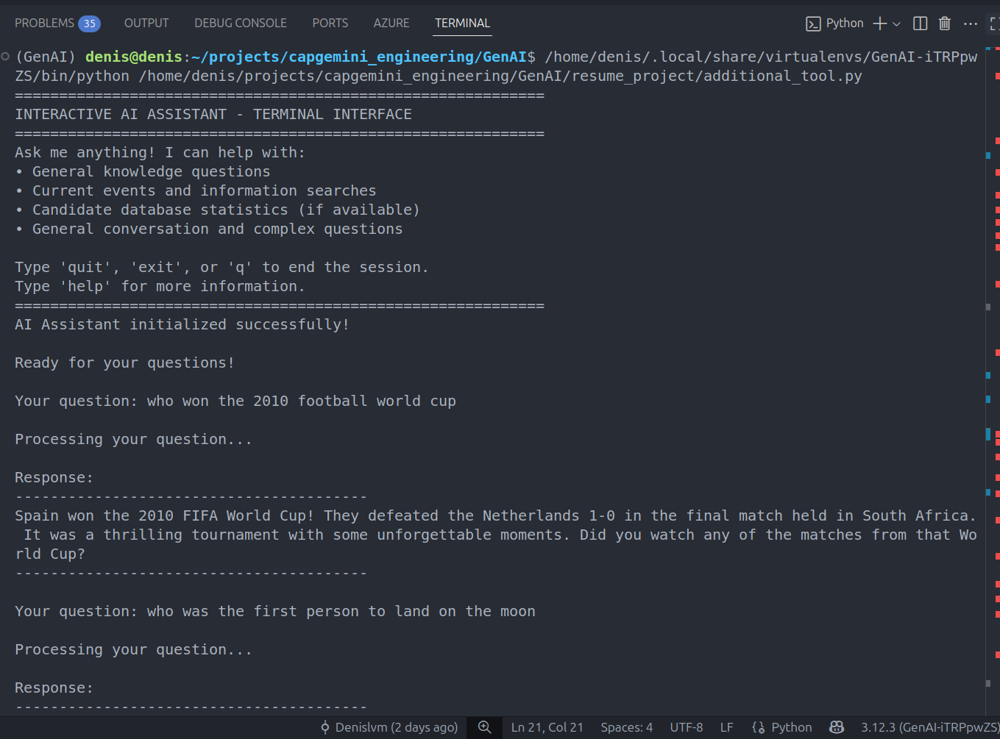
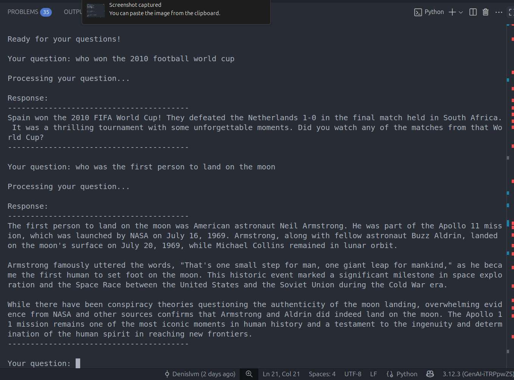
#### b. one of pre-build tools:
#### https://docs.llamaindex.ai/en/stable/community/integrations/
##### I chose an application with the ability to download data, and after initialization, the agent can answer your questions about this book/file. To run this streamlit app:
```
streamlit run resume_project/streamlit_chatbot.py
``` 
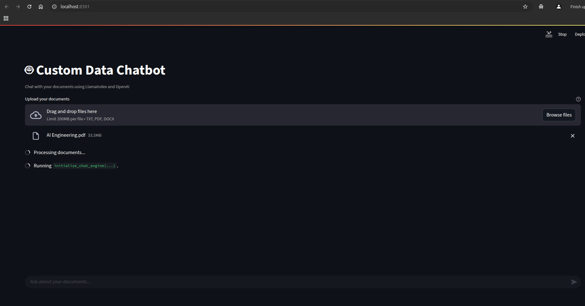
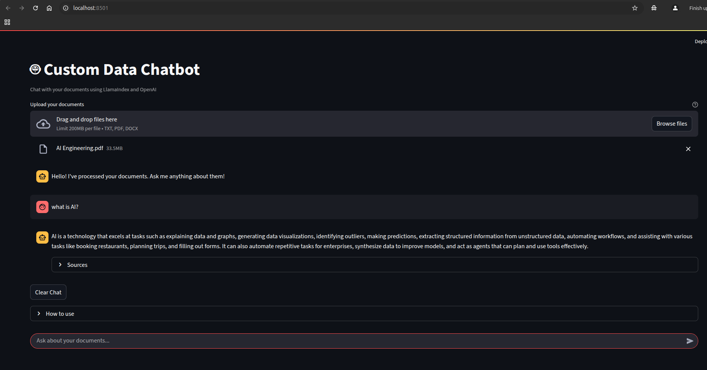
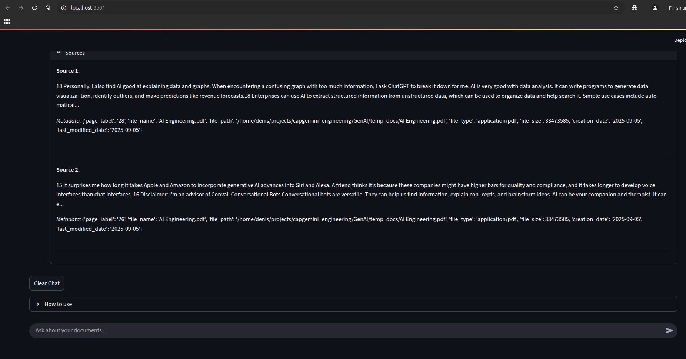
#### 3. Integrate the ReAct agent:
```
python resume_project/toolkit.py
```
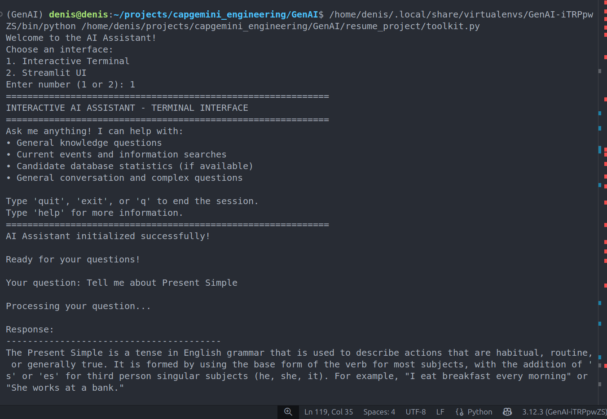
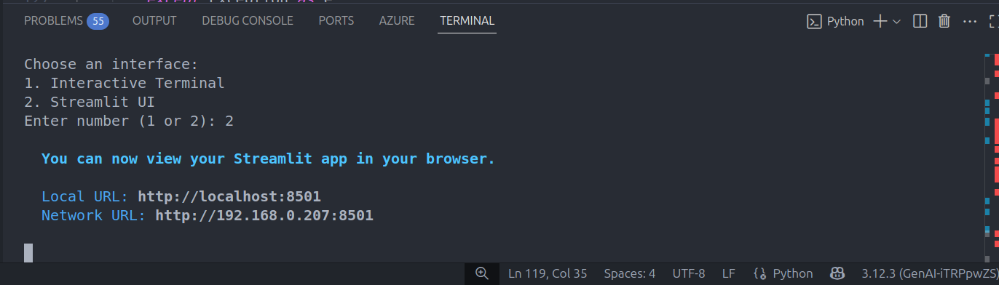
